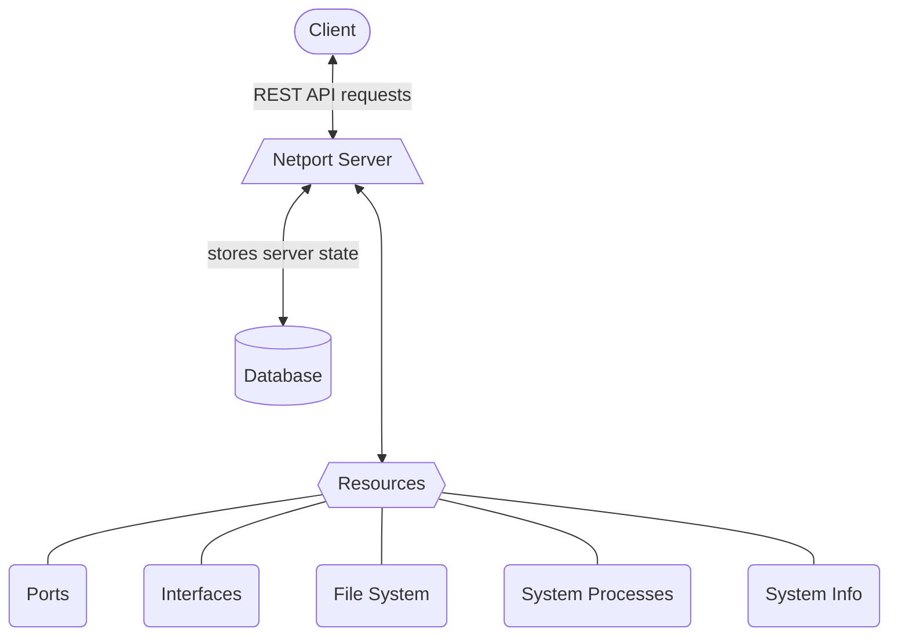

# Netport


Netport is a tool for managing single-access resources on the target Unix machine. Netport manages
the access to different types of resources on the operating system by not allowing multiple requests
to the same resource. For example ports, files, processes, network interfaces, and more...

# How it works



## Framework

Netport runs in a single python process on the target machine. It uses the
[FastAPI](https://fastapi.tiangolo.com/) framework to make a high performance and easy to use REST
api server. By using this api, users can easily perform a variety of requests to various resources.

There are many types of requests that can be made:

* Acquire a free port.
* Check if file exists
* Declare that a file is being used
* Start a process
* Get a list of already acquired resources

And many more...

## Backend Storage

In order to maintain an active memory of the used resources, Netport communicates with a database.
There are 2 types of supported databases that netport uses:

* Redis database
* Local pythonic database.

Both databases serve the same purpose for netport, but their inner functionality still a bit
different, with one draw back for the local database. **The local database doesn't save netport's
state after a shutdown or a reboot**.

The decision whether to use redis DB or a local one, depends by the user. In case of an unexpected
shutdown, with redis the state of netport will be stored and on reboot it will continue from where
it stopped. On the other hand, for much simpler systems this feature might be unnecessary
complicated.

# Installation

Make sure that python is installed on your machine (3.7 and above). Open your terminal and run the
following command:

```shell
pip install netport
```

> _It is advised to use a dedicated python virtual environment for netport._

# Developer Installation

Install poetry by following the instructions [here](https://python-poetry.org/docs/).

1. Clone this repository:

```shell
git clone https://github.com/IgalKolihman/netport.git
```

2. Install the development environment:

```shell
poetry install --with dev
```

# Usage

Please follow the [installation procedure](#installation) to be able to run Netport. After that
netport will be available to you as long as you are using it's virtual environment.

To run netport with basic configurations, run:

```shell
netport
```

After executing this command, a link will appear in the terminal to the server's url. The API
documentation will be available at: _**"http://host_ip:port/docs"**_

For more advanced information regarding netport execution, run the following command:

```shell
netport -h
```